# Machine learning based assessment of the tumour immune infiltrate

This is the repository for the assessment of tumor immune infiltrate using QuPath.

## **Project preparation**

**Step 1**: Download and install the QuPath on your system from here: https://qupath.github.io/

Version 0.4.2 was used in this study.

**Step 2**: Create a QuPath project. You can find the instructions here: https://qupath.readthedocs.io/en/stable/docs/tutorials/projects.html#create-a-project

**Step 3**: Annotate the image areas (https://qupath.readthedocs.io/en/stable/docs/tutorials/cell_detection.html#annotate-a-region-of-interest) or load the annotation files.

**Step 4**: Save the project for the further analysis.

-------------------------------------------------------------------------------------------------------------------

## **Color deconvolution** to mitigate stain variabilitis in images

1. Draw a small rectangle in an area that is representative of the stain you want to characterize – or the background.

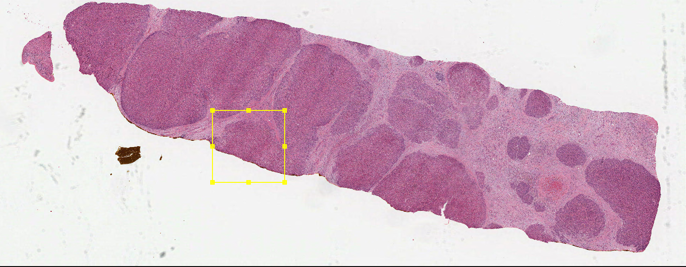

2. Double-click on the corresponding stain (or background) under the Image tab and follow the prompts to update the vectors.

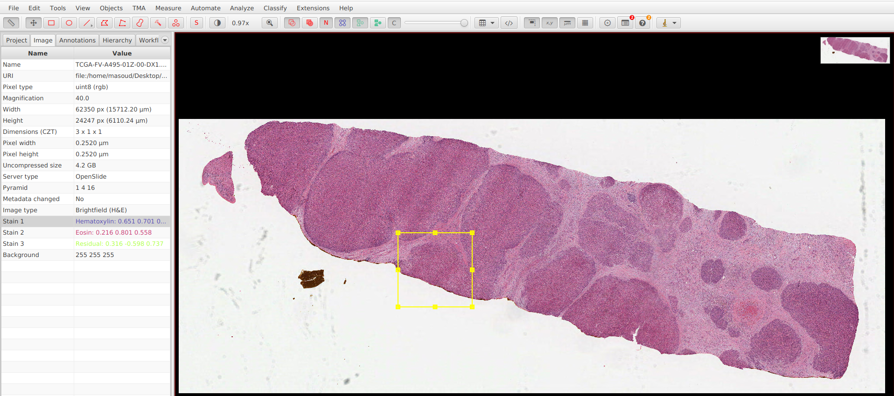

3. Repeat this for other stains if needed.

4. Use Analyze -> Preprocessing -> Estimate stain vectors. This records stain vectors in the command history.

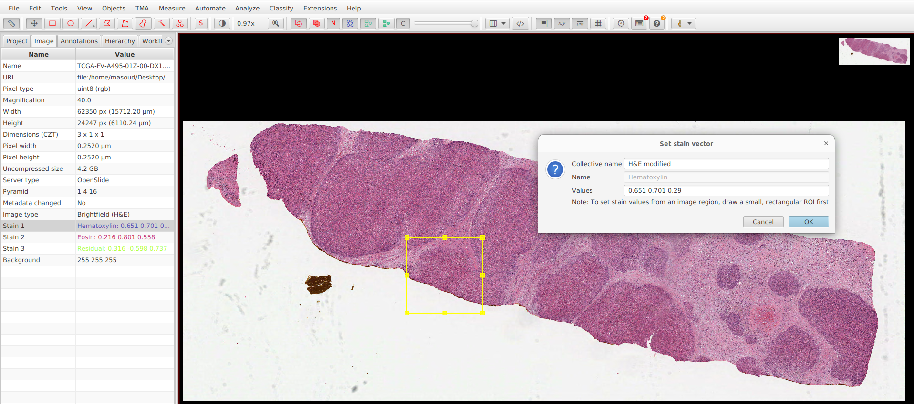

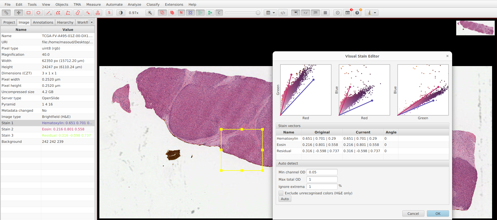

5. Now, we can generate a script that applies the color deconvolution to all images in the project. To use the script, click on Automate tab -> script editor and use the obtained values like the commands below:

```setImageType('BRIGHTFIELD_H_DAB');```

```setColorDeconvolutionStains('{"Name" : "H&E adjusted", "Stain 1" : "Hematoxylin", "Values 1" : "0.65 0.70 0.29 ", "Stain 2" : "Eiosin", "Values 2" : "0.27 0.56 0.77 ", "Background" : " 255 255 255 "}');```

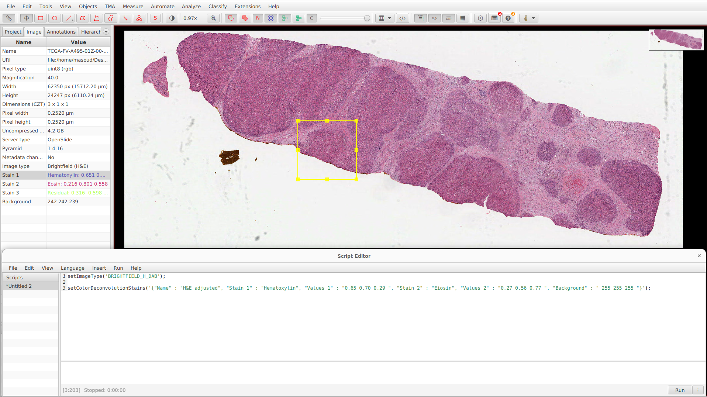

-------------------------------------------------------------------------------------------------------------------

## **StarDist** for cell detection and segmentation

1. Download and install the StarDist extension for QuPath from here: https://github.com/qupath/qupath-extension-stardist

2. To use the StarDist, click on Extensions tab in QuPath -> StarDist -> select the proper model for your task.

##### **Each pretrained model has its own individual .pb file that should be downloaded before using the StartDist.**

##### **QuPath’s StarDist support is only available by scripting.**

3. Select the region you want to perform cell detection and segmentation. It can be one or more boxes, circles, or annotated regions in the image.

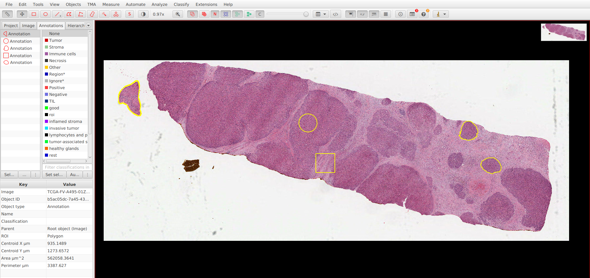

4. Run the StarDist script. The following code can be used for H&E-stained images and more examples can be found here: https://qupath.readthedocs.io/en/0.4/docs/deep/stardist.html.

```
import qupath.ext.stardist.StarDist2D

// Specify the model file (you will need to change this!)
def pathModel = '/path/to/he_heavy_augment.pb'

def stardist = StarDist2D.builder(pathModel)
      .threshold(0.3)              // Prediction threshold (0.3 worked best in our experiments)
      .normalizePercentiles(1, 99) // Percentile normalization
      .pixelSize(0.5)              // Resolution for detection
      .build()

// Run detection for the selected objects
def imageData = getCurrentImageData()
def pathObjects = getSelectedObjects()
if (pathObjects.isEmpty()) {
    Dialogs.showErrorMessage("StarDist", "Please select a parent object!")
    return
}
stardist.detectObjects(imageData, pathObjects)
println 'Done!'
```

  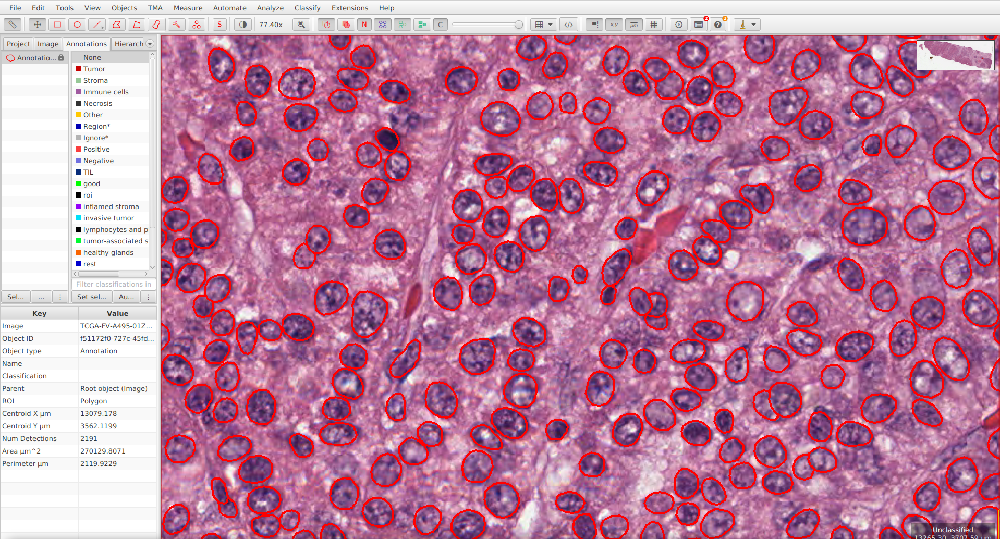

5. Measurements can be exported from the Measure tab -> Show annotation/detection measurements for further evaluations.

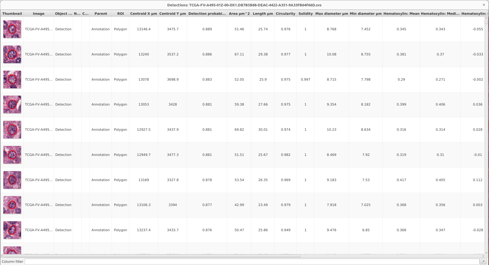

-------------------------------------------------------------------------------------------------------------------

## **Training the Cell classifier** using the measurements obtained from the StarDist

After running the StarDist, detected cells can be used to train a cell classifier.

1. To start, click on the Classify tab -> Object classification -> Train object classification
(In the pop-up window, many options like three different algorithms, features for classification, number of classes, etc, can be selected for the model training.)

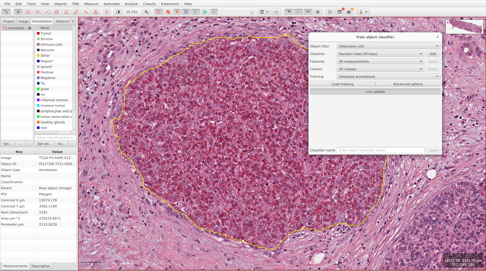

2. Annotate the detected cells using the available tools like brush, wand, etc in QuPath. Annotating more instances leads to more accurate classifiers. Live update option can help to see the class distributions and live predictions in QuPath.  

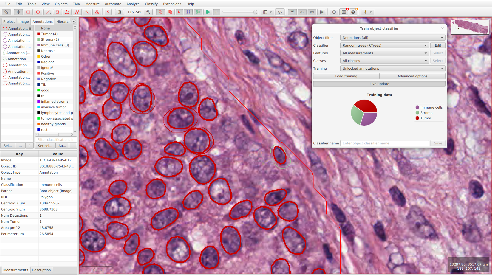

3. Save the classifier.

##### **Multiple ROIs can be added for training by "Load training" option. Alternatively, a single composite training image can be generated via Classify -> Training images -> Create training image, and annotation and training can then be performed on this composite image.**
##### **In this step, in addition to extracted features from the StarDist, extra features can be added from the Analyze tab -> Calculate features -> Add smoothed/intensity/shape features.**

In this study, we used the following script to add extra features to our cell classifier model.

```
selectDetections();
runPlugin('qupath.lib.algorithms.IntensityFeaturesPlugin', '{"pixelSizeMicrons": 0.5,  "region": "ROI",  "tileSizeMicrons": 25.0,  "colorOD": true,  "colorStain1": true,  "colorStain2": true,  "colorStain3": true,  "colorRed": true,  "colorGreen": true,  "colorBlue": true,  "colorHue": true,  "colorSaturation": true,  "colorBrightness": true,  "doMean": true,  "doStdDev": true,  "doMinMax": true,  "doMedian": true,  "doHaralick": true,  "haralickDistance": 1,  "haralickBins": 32}');
selectAnnotations();
runPlugin('qupath.lib.plugins.objects.SmoothFeaturesPlugin', '{"fwhmMicrons": 25.0,  "smoothWithinClasses": false,  "useLegacyNames": false}');
selectAnnotations();
runPlugin('qupath.lib.plugins.objects.SmoothFeaturesPlugin', '{"fwhmMicrons": 50.0,  "smoothWithinClasses": false,  "useLegacyNames": false}');
selectAnnotations();
runPlugin('qupath.lib.plugins.objects.SmoothFeaturesPlugin', '{"fwhmMicrons": 100.0,  "smoothWithinClasses": false,  "useLegacyNames": false}');
```

We used the following parameters and features for the training,

```
Algorithm: Random Forest
Parameters:
  - max_depth = 25
  - min_samples = 5
  - max_trees = 100
  - active_vars = 10

Features:
  - RGB values
  - Hematoxylin intensity
  - Eosin intensity
  - Multiscale sigma features (σ = 1, 2, 4, 8)
  - Texture descriptors:
      - Laplacian
      - Gradient magnitude
      - Weighted deviation
```

-------------------------------------------------------------------------------------------------------------------

## **Testing the trained cell classifier**

To apply the trained model on images, you should perform the following steps:

1. Select the regions.

2. Run the StarDist to detect cells.

3.  Load the saved model from Classify -> Object classification -> Load object classification.

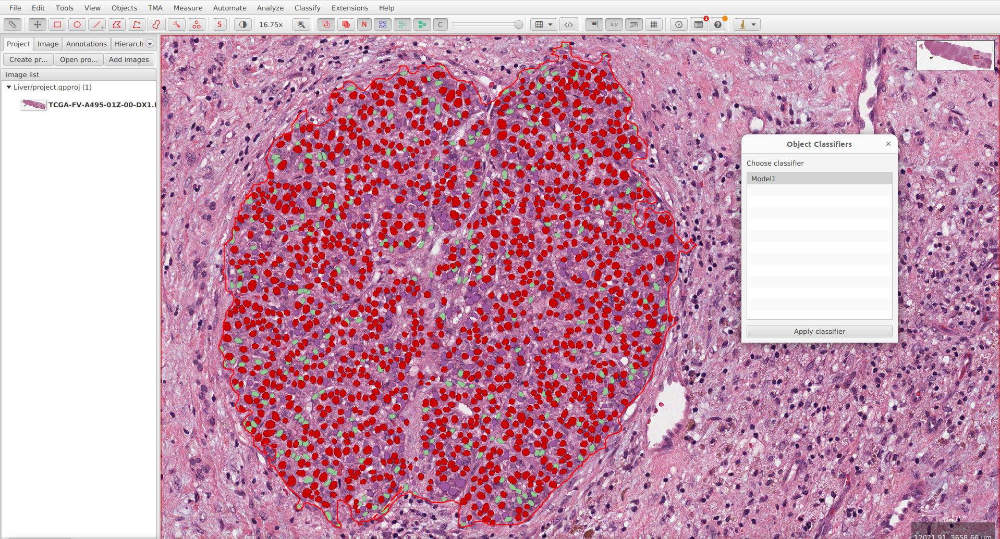

4. Export the results. 

-------------------------------------------------------------------------------------------------------------------

## **Automating the whole process** using the groovy scripts

For those feeling comfortable using the scripts, the provided codes in [`Codes/`](Codes/) folder can be used.

-------------------------------------------------------------------------------------------------------------------

## **Citing our work**

If you use our codes, please cite our work as follows:

Rakaee M, Adib E, Ricciuti B, Sholl LM, Shi W, Alessi JV, et al. Association of Machine Learning-Based Assessment of Tumor-Infiltrating Lymphocytes on Standard Histologic Images With Outcomes of Immunotherapy in Patients With NSCLC. JAMA Oncol 2022.

-------------------------------------------------------------------------------------------------------------------

We hope this information helps you replicate the method we have used. If you have any questions, please do not hesitate to contact us.


